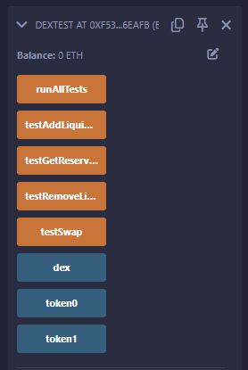

# Solidity Assignment DEX

## Deployment
- Network Name: Polygon Amoy Testnet
- Amoy testnet for Polygon PoS is being launched, a second testnet that provides a low-stakes environment to build, test, and break things. 
- Amoy will use Ethereum’s Sepolia testnet as the root (L1) chain.

  
# Information about Contract

# DEX.sol
- Contract Overview:
This is a test contract for a Decentralized Exchange (DEX) implementation. Its purpose is to verify that the main DEX contract functions correctly by running a series of tests.
Imports and State Variables:

- It imports the DEX contract and OpenZeppelin's IERC20 interface.
It declares public variables for the DEX and two test tokens.
INITIAL_SUPPLY is set to 1 million tokens (with 18 decimal places).

- Events:

TestResult event is used to emit the results of each test.

- Constructor:

Creates a new instance of the DEX contract.
Creates two TestToken instances (token0 and token1) with the INITIAL_SUPPLY.

- Test Functions:
a. testAddLiquidity():

Approves and adds liquidity to the DEX.
Checks if the reserves match the added amounts.

b. testSwap():

Approves and performs a token swap.
Verifies that the balance of the received token has increased.

c. testRemoveLiquidity():

Adds liquidity, then removes all of it.
Checks if the balances of both tokens have increased after removal.

d. testGetReserves():

Adds liquidity and then checks if getReserves() returns the correct values.

- runAllTests():

A convenience function that runs all the test functions in sequence.

# DEX TestCase.sol

- Purpose:
This contract is designed to test the functionality of a Decentralized Exchange (DEX) smart contract. It provides a suite of tests to verify that the core operations of the DEX are working as expected.
Contract Structure:

It imports the DEX contract and OpenZeppelin's IERC20 interface.
It declares public variables for the DEX and two test tokens.
INITIAL_SUPPLY is set to 1 million tokens (with 18 decimal places).

- Events:

TestResult event is used to emit the results of each test, including the test name and whether it passed.

- Constructor:

Creates a new instance of the DEX contract.
Creates two TestToken instances (token0 and token1) with the INITIAL_SUPPLY.

- Test Functions:
a. testAddLiquidity():

Approves and adds liquidity to the DEX.
Verifies if the reserves match the added amounts.
Emits a TestResult event with the outcome.

b. testSwap():

Approves and performs a token swap.
Checks if the balance of the received token has increased after the swap.
Emits a TestResult event with the outcome.

c. testRemoveLiquidity():

Adds liquidity to the DEX.
Removes all the liquidity.
Verifies if the balances of both tokens have increased after removal.
Emits a TestResult event with the outcome.

d. testGetReserves():

Adds liquidity to the DEX.
Calls getReserves() and verifies if it returns the correct values.
Emits a TestResult event with the outcome.

- runAllTests():

A convenience function that executes all the test functions in sequence.

# TestCases example:

 
    

      
    

   
