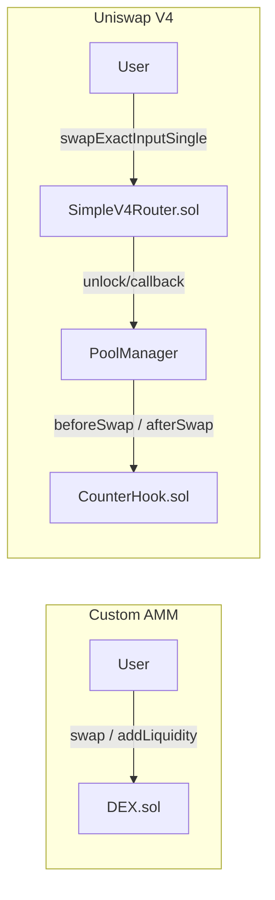

# Hardened DEX + Uniswap V4 Hook

A constant-product AMM rewritten from a vulnerable original, plus a minimal Uniswap V4 hook, router, and frontend integration. Built and tested with Foundry against real OpenZeppelin and Uniswap v4-core contracts, not mocks.


[](https://github.com/raj-1106/DEX/actions/workflows/test.yml)


Replace `<owner>/<repo>` in the badge URL above once this is pushed to GitHub. Unlike the other badges, this one isn't decorative text I typed by hand: it's generated by GitHub from `.github/workflows/test.yml` and flips red the moment any of the 27 tests fail on a real push, which is the actual point of putting it here rather than a claim in prose.

---

## Contents

- [What's in here](#whats-in-here)
- [Threat model](#threat-model)
- [Project structure](#project-structure)
- [Quickstart](#quickstart)
- [Verifying this yourself](#verifying-this-yourself)
- [Testing](#testing)
- [Deploying to a testnet](#deploying-to-a-testnet)
- [Frontend](#frontend)
- [Known limitations](#known-limitations)
- [License](#license)

---

## What's in here

| Component | File | Purpose |
|---|---|---|
| Custom AMM | `src/DEX.sol` | Standalone constant-product DEX, hardened rewrite of an exploitable original |
| V4 hook | `src/hooks/CounterHook.sol` | Low-privilege hook registered on a real Uniswap V4 `PoolManager` |
| V4 router | `src/hooks/SimpleV4Router.sol` | Minimal single-hop swap router (V4 has no direct `swap()` a frontend can call) |
| Test mocks | `src/mocks/Mocks.sol` | Fee-on-transfer, non-compliant, and reentrancy-attacking ERC20s used to *prove* the fixes, not just assert them |
| Frontend | `frontend/` | React + wagmi + viem components for both the custom DEX and the V4 pool |


```mermaid
flowchart LR
    subgraph Custom AMM
        U1[User] -->|swap / addLiquidity| DEX[DEX.sol]
    end
    subgraph Uniswap V4
        U2[User] -->|swapExactInputSingle| R[SimpleV4Router.sol]
        R -->|unlock/callback| PM[PoolManager]
        PM -->|beforeSwap / afterSwap| H[CounterHook.sol]
    end
```

## Threat model

`DEX.sol` started as a contract with a drainable reentrancy bug, a split-liquidity pool-key bug, no first-depositor protection, no slippage protection, and unchecked ERC20 transfers. Each fix below was tested against a mock token built specifically to trigger the original bug, not just documented.

| Risk | Original contract | This rewrite | Proven by |
|---|---|---|---|
| Reentrancy drain | No guard; state updated after external calls | `ReentrancyGuard` on every state-changing function | `test_Reentrancy_SwapBlocked`, `test_Reentrancy_AddLiquidityBlocked` — a malicious token actively attempts reentry |
| Split liquidity pools | `pools[A][B] != pools[B][A]` | Tokens sorted before every storage access | `test_AddLiquidity_OrderIndependence` |
| First-depositor share inflation | No minimum liquidity lock | `MINIMUM_LIQUIDITY` permanently unspendable | `test_AddLiquidity_MinimumLiquidityIsLockedForever` |
| Sandwich / MEV | No slippage or deadline params | `amountOutMin`/`amountMin` + `deadline` on every function | `test_*_RevertsOnSlippage`, `test_*_RevertsOnExpiredDeadline` |
| Fee-on-transfer tokens | Reserves credited with requested amount, not received amount | Reserves credited from measured balance deltas | `test_Swap_FeeOnTransferToken_PricesOffActualReceived` |
| Non-compliant ERC20s | Raw `transfer`/`transferFrom`, return value ignored | `SafeERC20` throughout | `test_AddLiquidity_RevertsOnNonCompliantTokenTransfer` |

**Residual risk, stated plainly, not hidden:** `swap()` still calls out to `tokenIn` before reserves are finalized (required to support fee-on-transfer tokens). `nonReentrant` is the sole defense against this being exploitable, not call ordering. LP positions are an internal mapping, not a transferable ERC20. See inline comments in `DEX.sol` and `CounterHook.sol` for the rest.

## Project structure

```
dex-rewrite/
├── script/
│   ├── DeployDEX.s.sol        # deploy the custom DEX
│   ├── DeployV4Hook.s.sol     # deploy CounterHook + register a V4 pool
│   └── DeployRouter.s.sol     # deploy SimpleV4Router
├── src/
│   ├── DEX.sol
│   ├── hooks/
│   │   ├── CounterHook.sol
│   │   └── SimpleV4Router.sol
│   └── mocks/
│       └── Mocks.sol
├── test/
│   ├── DEX.t.sol               # 18 tests
│   └── V4Hook.t.sol            # 9 tests, against a real PoolManager
├── frontend/
│   ├── lib/                    # wagmi config, contract addresses/ABIs
│   ├── components/             # DexSwapPanel.tsx, V4SwapPanel.tsx
│   └── abi/                    # exported via `forge inspect ... abi --json`
├── abi/
├── foundry.toml
├── remappings.txt
└── README.md
```

## Quickstart

```bash
# Foundry
curl -L https://foundry.paradigm.xyz | bash && foundryup

# Dependencies — pinned to exact tested versions, not "whatever main is today"
forge install foundry-rs/forge-std@v1.9.7 --no-git
forge install OpenZeppelin/openzeppelin-contracts@v5.7.0 --no-git
forge install Uniswap/v4-core@46c6834698c48bc4a463a86d8420f4eb1d7f3b75 --no-git
forge install Uniswap/v4-periphery@dce236d4e2057422d0791d9a973a58765eb46f65 --no-git

# Build
forge build
```

`v4-core` is pinned to a specific commit rather than its `v4.0.0` tag on purpose: the tag predates `PoolOperation.sol`, which this repo's hook and router both import, so building against the tag fails outright. `v4-periphery` has no tagged releases at all as of this writing, so its pin is a commit hash too. Re-verified end to end against these exact four pins: `forge build` succeeds and all 27 tests still pass.

`foundry.toml` pins `solc = "0.8.26"` and `via_ir = true`. Both are required: `v4-core`'s `PoolManager.sol` pins solc `0.8.26` exactly (non-caret pragma), and several functions here have enough local variables to hit "stack too deep" without `via_ir`. If `forge build` fails to auto-fetch solc 0.8.26 on a network-restricted machine or CI runner:

```bash
curl -sL -o solc https://github.com/ethereum/solidity/releases/download/v0.8.26/solc-static-linux
chmod +x solc && mkdir -p ~/.svm/0.8.26 && cp solc ~/.svm/0.8.26/solc-0.8.26
```

## Verifying this yourself

Test names in this doc are not the proof, they're pointers. The proof is that you (or CI) can run them and see the same result:

```bash
forge test -vv
```

Three things make that check trustworthy rather than a one-time claim:

1. **Pinned dependencies.** Every `forge install` above is pinned to an exact tag or commit, not a moving branch. `Uniswap/v4-core` in particular is pinned to a commit rather than its own `v4.0.0` tag, because that tag predates `PoolOperation.sol`, which this repo imports — building against the tagged release fails outright. Verified by actually reinstalling from scratch against these exact pins and re-running the full suite before writing this down.
2. **CI on every push.** `.github/workflows/test.yml` runs `forge fmt --check`, `forge build`, and `forge test -vv` against the same pinned dependencies. The badge at the top of this file reflects the real, current state of the repo, not a snapshot from whenever this README was written.
3. **Tests that attack, not just assert.** `test_Reentrancy_SwapBlocked` and `test_Reentrancy_AddLiquidityBlocked` deploy `ReentrantAttackerToken` and have it actively attempt to re-enter mid-`transferFrom`; the test passes because that attempt reverts, not because a modifier is present in the source. Same pattern for the fee-on-transfer, non-compliant-token, and mismatched-hook-permission tests.

If any of these three legs is missing, treat "tests are passing" claims (including this repo's, at a later commit) with appropriate skepticism.

## Testing

```bash
forge test -vv                                  # everything (27 tests)
forge test --match-path test/DEX.t.sol -vv       # custom AMM (18 tests)
forge test --match-path test/V4Hook.t.sol -vv    # V4 hook + router (9 tests)
```

Every function is covered with a main case, at least one edge case, and at least one failure case, plus dedicated attack tests (reentrancy, mismatched hook permissions, non-compliant tokens) that actively try to break the contract rather than merely assert an outcome.

## Deploying to a testnet

Requires an RPC URL and a funded private key. Set them as environment variables, never hardcode a private key or commit it:

```bash
export RPC_URL="<your rpc url>"
export PRIVATE_KEY="<funded testnet key>"
export ETHERSCAN_API_KEY="<optional, for --verify — BscScan needs its own key, not Etherscan's>"

# 1. Custom DEX — standalone, no external dependencies
forge script script/DeployDEX.s.sol \
  --rpc-url $RPC_URL --private-key $PRIVATE_KEY \
  --broadcast --verify --etherscan-api-key $ETHERSCAN_API_KEY

# 2. V4 hook + pool — requires a real PoolManager already deployed on your target chain.
#    Verify the address is actually live before spending gas:
cast code <POOL_MANAGER_ADDRESS> --rpc-url $RPC_URL
export POOL_MANAGER="<verified address>"
export TOKEN0="<lower-address test token>"
export TOKEN1="<higher-address test token>"
forge script script/DeployV4Hook.s.sol --rpc-url $RPC_URL --private-key $PRIVATE_KEY --broadcast

# 3. Router — same POOL_MANAGER as step 2
forge script script/DeployRouter.s.sol --rpc-url $RPC_URL --private-key $PRIVATE_KEY --broadcast
```

**Uniswap V4 is not deployed on every chain/testnet.** Confirmed against Uniswap's own `sdks` repo: Sepolia has an address (flagged by Uniswap's own source comments as possibly stale — verify with `cast code` first), BSC/BNB **testnet** has none listed at all. If you're targeting a chain without an official `PoolManager`, you'd need to deploy `v4-core`'s `PoolManager.sol` yourself first (the source is already vendored under `lib/v4-core/`).

## Frontend

```bash
cd frontend
npm install wagmi viem @tanstack/react-query
```

```
# .env.local
NEXT_PUBLIC_RPC_URL=
NEXT_PUBLIC_DEX_ADDRESS=
NEXT_PUBLIC_HOOK_ADDRESS=
NEXT_PUBLIC_ROUTER_ADDRESS=
```

| File | What it does |
|---|---|
| `frontend/lib/wagmi.ts` | wagmi config |
| `frontend/lib/contracts.ts` | addresses + ABIs, exported straight from `forge inspect`, not hand-written |
| `frontend/components/DexSwapPanel.tsx` | approve + swap on the custom DEX |
| `frontend/components/V4SwapPanel.tsx` | quote (`V4Quoter`) + approve + swap (`SimpleV4Router`) on the V4 pool |

`DexSwapPanel.tsx` currently passes `amountOutMin = 0`, meaning **no slippage protection** in that example, for readability. Wire in a quote before using it beyond a demo.

## Known limitations

- LP positions on the custom DEX are an internal mapping, not a transferable ERC20. A production Uniswap V2-style deployment would give each pool its own LP token via a factory + clone pattern.
- Custom DEX supports two-token constant-product pools only; no multi-hop routing.
- `CounterHook` requests no return-delta permissions by design, so it counts events but cannot adjust price or fees. Extending it to do so reopens the attack-surface analysis in `CounterHook.sol`'s comments.
- Deployment scripts are compiled and unit-tested against a local Foundry EVM, but have not been broadcast to any live network as part of this build.
